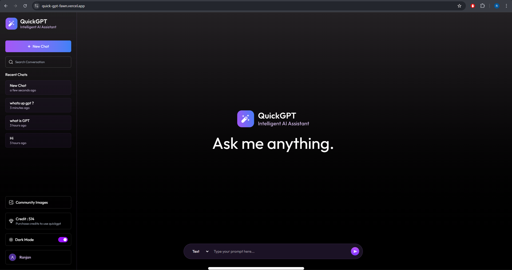

🤖 QuickGPT - Intelligent AI Assistant

QuickGPT is a sleek and AI-powered assistant built with the MERN stack.
It allows users to start conversations instantly, ask questions, and receive quick, accurate responses.
With features like conversation history, dark mode, and credit-based usage, QuickGPT ensures a smooth and interactive chat experience.

🌐 Live Demo → [QuickGPT](https://quick-gpt-fawn.vercel.app/)

✨ Features

💬 Instant Conversations – Ask anything and get quick, reliable AI responses.

🕒 Conversation History – Keep track of past chats.

🌙 Dark Mode – Modern UI with theme toggle support.

⚡ Credit-Based Usage – Manage and control API usage efficiently.

🚀 Deployed on Vercel – Fast, reliable, and scalable hosting.

🎨 Modern UI/UX – Sleek, intuitive interface for smooth interactions.

🛠️ Tech Stack

Frontend: React.js, Tailwind CSS, Context (for state management)
Backend: Node.js, Express.js
Database: MongoDB
AI Integration: Gemini API
Hosting: Vercel,

📸 Screenshots

⚙️ Installation & Setup

Clone the repository:

git clone https://github.com/ranjan-sw-developer/quick-gpt
cd quick-gpt

🔹 Backend Setup
cd server
npm install

Create a .env file in server/ with:

PORT=5000
MONGODB_URI=your_mongodb_connection_string
GEMINI_API_KEY=your_openai_api_key
JWT_SECRET=your_secret_key
IMAGEKIT_PUBLIC_KEY=public_key
IMAGEKIT_PRIVATE_KEY=private_key
IMAGEKIT_URL_ENDPOINT=url_endpoint
STRIPE_PUBLISHABLE_KEY=stripe_publishable_key
STRIPE_SECRET_KEY=stripe_secret_key
STRIPE_WEBHOOK_SECRET=stripe_webhook_secret

Run backend server:

npm run server

🔹 Frontend Setup
cd client
npm install

Run frontend:

npm run dev

App will run at http://localhost:3000
🚀

📊 Key Highlights

Seamless integration with AI APIs for real-time responses.

Secure credit system for usage tracking.

Scalable MERN architecture for future enhancements.

🔥 Built with ❤️ using the MERN Stack + AI
